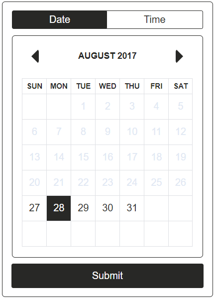
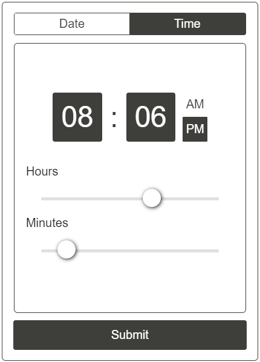

# react-dateme
Yet another date/time component for react. Styled roughly after [this](https://github.com/wangzuo/input-moment) existing component, but for
a 12-hour clock and without any peerDependencies (other than React).

See examples/demo [here](https://jhavrick.github.io/react-dateme/test/).

### Screenshots
 

