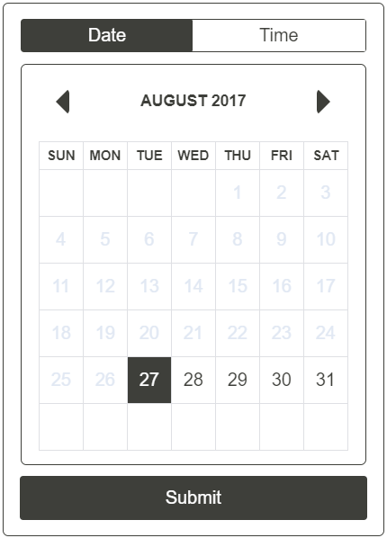

# react-dateme
Yet another date/time component for react. Styled roughly after [this](https://github.com/wangzuo/input-moment) existing component, but for
a 12-hour clock and without any peerDependencies (other than React).

See examples/demo [here](https://jhavrick.github.io/react-dateme/test/).

### Install

`npm install --save react-dateme`

### Usage

``` javascript
//Basic
<DateMe onChange={this.handleDateTimeChange} />

//Change color 
//If you need more control, see below about custom builds
<DateMe  onChange={this.handleDateTimeChange} 
         color="#2B0D57" />
         
//Future dates only
<DateMe  onChange={this.handleDateTimeChange} 
         futureOnly={true} />
         
//By default, DateMe will be set to the current date/time
//You can manually set a different initial time
<DateMe  onChange={this.handleDateTimeChange} 
         futureOnly={true}
         month={0} 
         day={1} 
         year={2038} />


```

### Build
Install dependencies: `npm install`

Run one or all of the following commands, depending on your needs:

PRODUCTION:
- Build: `npm run build`
- Style: `npm run build-style`

DEVELOPEMENT:
- Build: `npm run dev`
- Build: `npm run style-dev`

### Screenshots
 


